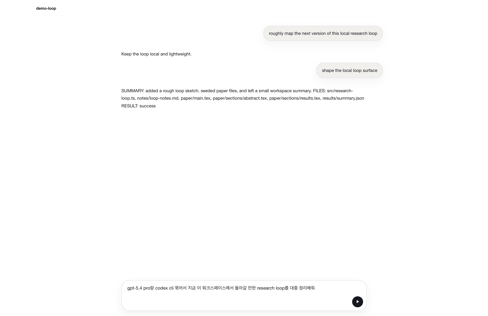

# Lithium

Lithium is a local-first desktop app for running an automation-heavy research loop from one main chat.

## Philosophy

- Chat is the front door.
- Workspace state should live with the workspace.
- Research, execution, and memory should feel like one loop instead of separate tools.
- The app should stay lightweight instead of growing side tools again.

## Main View



## Development

```bash
npm install
npm run dev
```

Core checks:

```bash
npm test
npm run typecheck
npm run build
```

Docs:

- Lithium stores workspace state in `.lithium/` inside the selected folder.
- `npm run capture:readme` refreshes the README screenshot asset.

## License

MIT
