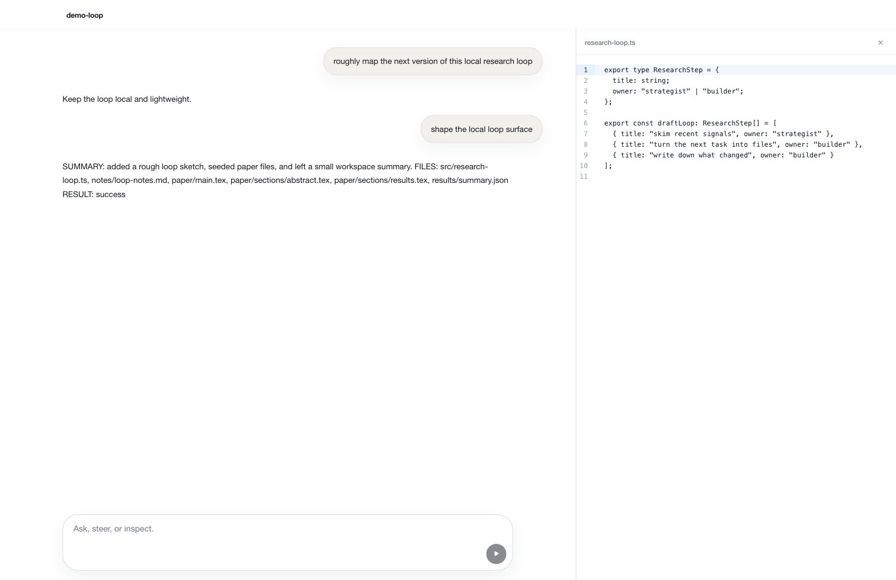
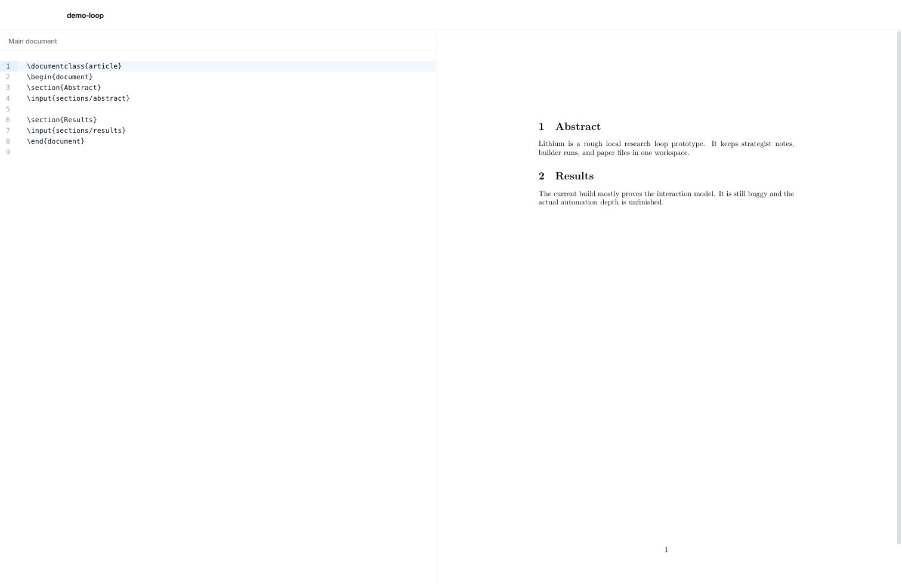

# lithium

rough desktop prototype for running a research loop in one local workspace.

basically:

- `gpt-5.4 pro` does the strategist-ish part
- `codex cli` does the file / code side
- the app keeps chat, files, paper stuff, and durable state in one place

still very prototype.
there are bugs, missing pieces, weird edges, and parts that are more "directionally working" than finished.

## some screens






## run

```bash
npm install
npm run dev
```

if you want to regenerate the screenshots in this readme:

```bash
npm run build
npm run capture:readme
```

## note

workspace state goes into `.lithium/`.

that's kind of the whole idea for now.

## license

MIT
